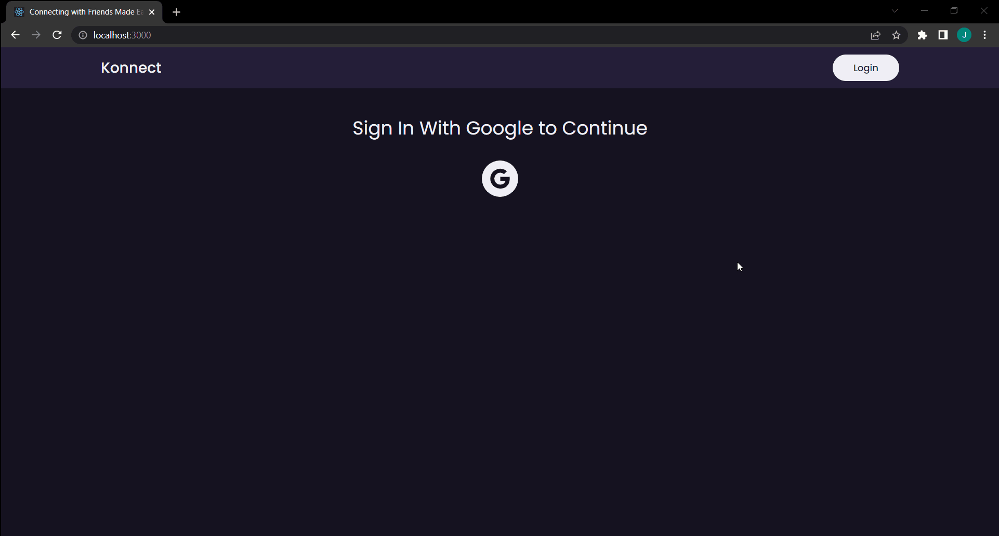

# Konnect Social Media Website

---

## Description
Konnect is a web-based application that focuses on communication, community-based input, interaction, content-sharing and collaboration. People use social media to stay in touch and interact with friends, family and various communities.

---

## Tech Stack
This app was built with TypeScript, React, Redux, and Firebase. 

---

## How to Install

`npm i && npm start`

---

## Live: 
https://ts-social-c2df9.firebaseapp.com/

Simply click on the link, login with a Google Account, and connect with friends.